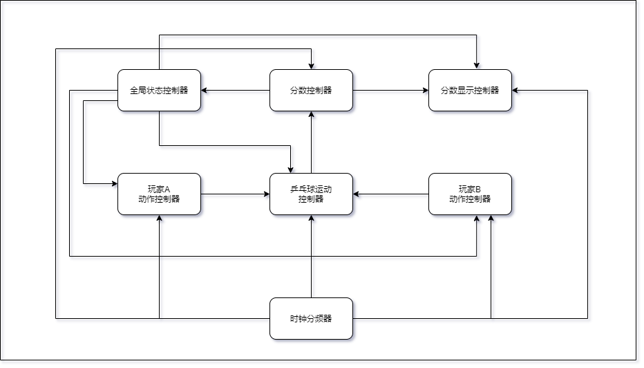

# 乒乓球比赛模拟机设计

## 需求

## 实现

+ 流程图

+ 组件说明

  + 全局状态控制器`GameController`

    用于控制整个模拟器各组件状态。

    + 输入：
      + `CLK`：时钟，上升沿触发。
      + `PlayerOneHit`：玩家`A`打击。
      + `PlayerOneSpeed`：玩家`B`速度。
      + `PlayerTwoHit`：玩家`B`打击。
      + `PlayerTwoS peed`：玩家`B`速度。
      + `serviceSide`：发球方。`0`表示`A`玩家，`1`表示`B`玩家。
      + `reset`：重置比赛

    + 输出：
      + `EnA`：玩家`A`使能。
      + `EnB`：玩家`B`使能。
      + `getScoreA`：玩家`A`的得分。
      + `getScoreB`：玩家`B`的得分。
      + `ballLocation [7:0]`：球的位置，第`i`位为`1`表示球在第`i`个位置。
    + 寄存器：
      + `status [2:0]`：
        + `010`表示`A`发球；
        + `001`表示`B`发球；
        + `110`表示玩家`A`接球；
        + `101`表示玩家`B`接球。
      + `accurateBallLocation [32:0]`：球的精确位置，范围为十进制`1000-9000`
      + `serviceSideDebugger`：调试发球方。`0`表示`A`玩家，`1`表示`B`玩家。

    + 初始时：
      + `status = 010`
      + `accurateBallLocation = 1000`
      + `serviceSideDebugger = 0`

    + 整体设计：
      + `ballLocation`与`accurateBallLocation`
        + `ballLocation = accurateBallLocation / 1000 - 1`
        + `status`为`110`时`accurateBallLocation`每`CLK`减少`ballSpeed * k`
        + `status`为`101`时`accurateBallLocation`每`CLK`增加`ballSpeed * k`
      + `status`
        + `status = 010`（`A`发球）
          + `accurateBallLocation = 1000`
          + `EnA = 1`
          + `EnB = 0`
          + `PlayerOneHit`出现上升沿时`status = 101`
        + `status = 001`（`B`发球）
          + `accurateBallLocation = 9000`
          + `EnA = 0`
          + `EnB = 1`
          + `PlayerOneHit`出现上升沿时`status = 110`
        + `status = 110`（`A`接球）
          + `accurateBallLocation`每`CLK`减少`ballSpeed * k`
          + `EnA = 1`
          + `EnB = 0`
          + `accurateBallLocation = [500, 1500]`且`PlayerOneHit`出现上升沿时：
            + `status = 101`
            + `accurateBallLocation = 1000`
          + `accurateBallLocation < 500`时：
            + `serviceSideDebugger ^= 1`
            + `status = serviceSideDebugger ? 001 : 010`
            + `getScoreA`出现上升沿
        + `status = 101`（`B`接球）
          + `accurateBallLocation`每`CLK`增加`ballSpeed * k`
          + `EnA = 0`
          + `EnB = 1`
          + `accurateBallLocation = [8500, 9500]`且`PlayerTwoHit`出现上升沿时：
            + `status = 110`
            + `accurateBallLocation = 9000`
          + `accurateBallLocation > 9500`时：
            + `serviceSideDebugger ^= 1`
            + `status = serviceSideDebugger ? 001 : 010`
            + `getScoreA`出现上升沿

  + 玩家控制器 `Player`

    控制玩家输入与接发球操作。

    + 输入：
      + `CLK`：时钟，上升沿触发。
      + `EN`：玩家使能，轮到该玩家发球或接球时有效。
      + `hit`：连接开关，高电平有效，表面玩家做出击球动作。
      + `speed [1:0]`：该玩家期望的击球速度。
    + 输出：
      + `hitOut`：该玩家击球，当该`hit`上升沿与前一次`hit`下降沿有一定间隔时，`hitOut`出现上升沿。
      + `speedOut [1:0]`：该玩家期望的击球速度。
  
    `EN`有效时，把`hit`和`speed`传递给`hitOut`和`speedOut`

  + 分数控制器 `ScoreBoard`

      记录玩家分数。

    + 输入：
      + `CLK`：时钟，上升沿触发。
      + `getScoreA`：玩家`A`得分。
      + `getScoreB`：玩家`B`得分。
    + 输出：
      + `serviceSide`：发球方。`0`表示`A`玩家，`1`表示`B`玩家
      + `endGame`：记满`11`分，游戏结束。
      + `winner [1:0]`：游戏结束时，获胜的玩家，`10`为`A`，`01`为`B`，其他情况平局。
      + `scoreA`：玩家`A`的总得分。
      + `scoreB`：玩家`B`的总得分。

     `serviceSide, endGame`初始化为`0`

    每个`getScoreA`的上升沿`scoreA + 1`

    每个`getScoreB`的上升沿`scoreB + 1`

    `scoreA + scoreB > 5`时`currentResult = 1`

    `scoreA + scoreB = 11`时`endGame = 1`

    `endGame = 1`时，`scoreA < scoreB`则`winner = 10`，`scoreA > scoreB`则`winner = 01`，否则`winner = 00 或 11`

  + 分数显示器 `ScoreDisplay`

    显示当前信息

    + 输入：
      + `scoreA [3:0]`：玩家`A`的得分。
      + `scoreB [3:0]`：玩家`B`的得分。
      + `serviceSide`：发球方。`0`表示`A`玩家，`1`表示`B`玩家
      + `endGame`：记满`11`分，游戏结束。
      + `winner`：游戏结束时，获胜的玩家，`0`为`A`，`1`为`B`。
      + `status [2:0]`：`010`表示`A`发球，`001`表示`B`发球，`110`表示玩家`A`接球，`101`表示玩家`B`接球。
      + `ballLocation [7:0]`：球的位置，第`i`位为`1`表示球在第`i`个位置。
    + 输出：
      + `display [63:0]`：八个八段数码管的信号，显示赛况。
      + `track [7:0]`：八个LED信号，显示球的位置。
      + `serviceSideLED [1:0]`：显示发球方。
